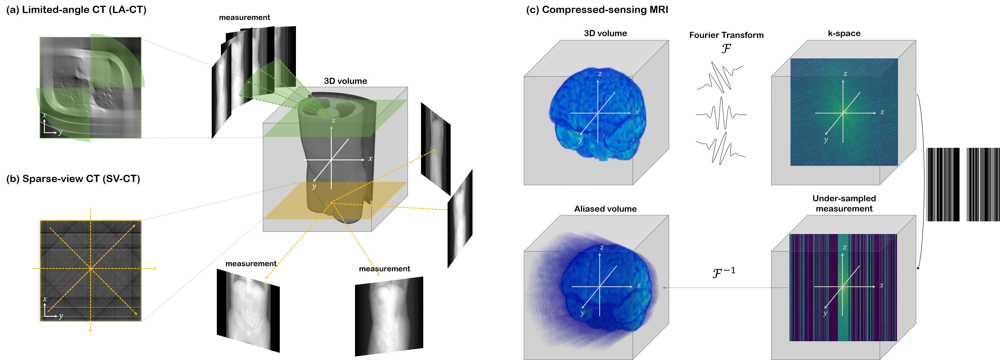
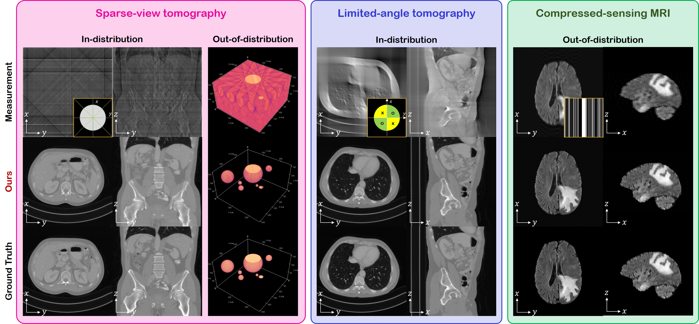

# Solving 3D Inverse Problems using Pre-trained 2D Diffusion Models (CVPR 2023)

Official PyTorch implementation of **DiffusionMBIR**, the CVPR 2023 paper "[Solving 3D Inverse Problems using Pre-trained 2D Diffusion Models](https://arxiv.org/abs/2211.10655)". Code modified from [score_sde_pytorch](https://github.com/yang-song/score_sde_pytorch).

[](https://arxiv.org/abs/2211.10655)
[](https://arxiv.org/abs/2211.10655)



## Getting started

### Download pre-trained model weights
* **CT** experiments
```bash
mkdir -p exp/ve/AAPM_256_ncsnpp_continuous
wget -O exp/ve/AAPM_256_ncsnpp_continuous/checkpoint_185.pth https://www.dropbox.com/s/7zevc3eu8xkqx0x/checkpoint_185.pth?dl=1
```
* For **MRI** experiments
```bash
mkdir -p exp/ve/fastmri_knee_320_ncsnpp_continuous
wget -O exp/ve/fastmri_knee_320_ncsnpp_continuous/checkpoint_95.pth https://www.dropbox.com/s/27gtxkmh2dlkho9/checkpoint_95.pth?dl=1
```
(If your system does not have `wget` installed, you may replace `wget -O` with `curl -L -o`.)

### Download the data
* **CT** experiments (in-distribution)
```bash
DATA_DIR=./data/CT/ind/256_sorted
mkdir -p "$DATA_DIR"
wget -O "$DATA_DIR"/256_sorted.zip https://www.dropbox.com/sh/ibjpgo5seksjera/AADlhYqCWq5C4K0uWSrCL_JUa?dl=1
unzip -d "$DATA_DIR"/ "$DATA_DIR"/256_sorted.zip
```
* **CT** experiments (out-of-distribution)
```bash
DATA_DIR=./data/CT/ood/256_sorted
mkdir -p "$DATA_DIR"
wget -O "$DATA_DIR"/slice.zip https://www.dropbox.com/s/h3drrlx0pvutyoi/slice.zip?dl=0
unzip -d "$DATA_DIR"/ "$DATA_DIR"/slice.zip
```
* **MRI** experiments (out-of-distribution)
```bash
DATA_DIR=./data/MRI/BRATS
mkdir -p "$DATA_DIR"
wget -O "$DATA_DIR"/Brats18_CBICA_AAM_1.zip https://www.dropbox.com/s/1a73t58asbqs1mi/Brats18_CBICA_AAM_1.zip?dl=0
unzip -d "$DATA_DIR"/ "$DATA_DIR"/Brats18_CBICA_AAM_1.zip
```


* Make a conda environment and install dependencies
```bash
conda env create --file environment.yml
```

## DiffusionMBIR (fast) reconstruction
Once you have the pre-trained weights and the test data set up properly, you may run the following scripts. Modify the parameters in the python scripts directly to change experimental settings.

```bash
conda activate diffusion-mbir
python inverse_problem_solver_AAPM_3d_total.py
python inverse_problem_solver_BRATS_MRI_3d_total.py
```

## Training
You may train the diffusion model with your own data by using e.g.
```bash
bash train_AAPM256.sh
```
You can modify the training config with the ```--config``` flag.

## Citation
If you find our work interesting, please consider citing

```
@InProceedings{chung2023solving,
  title={Solving 3D Inverse Problems using Pre-trained 2D Diffusion Models},
  author={Chung, Hyungjin and Ryu, Dohoon and McCann, Michael T and Klasky, Marc L and Ye, Jong Chul},
  journal={IEEE/CVF Conference on Computer Vision and Pattern Recognition},
  year={2023}
}
```
